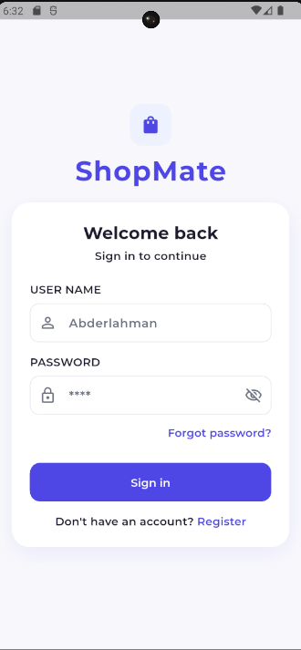
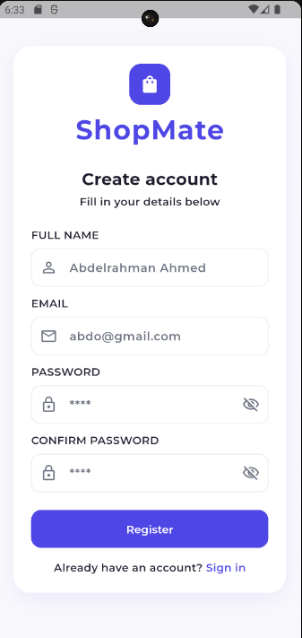
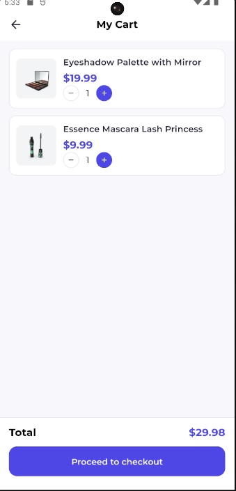
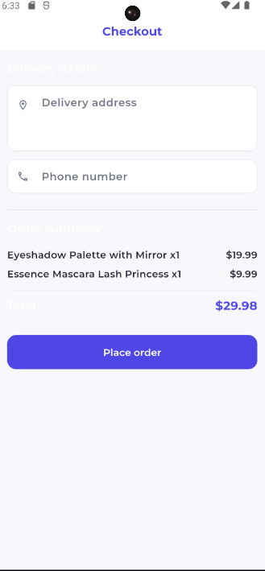
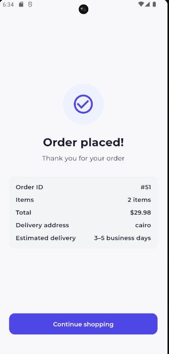

# 🛍️ ShopMate — Mini E-Commerce App

A Flutter mini e-commerce application built as a hiring task, demonstrating Clean Architecture, BLoC state management, and modern Flutter best practices.

---

## 📱 Screenshots

| Login | Register | Products |
|---|---|---|
|  |  |  |

| Cart | Checkout | Order |
|---|---|---|
|  |  |  |

---

## ✨ Features

- **Authentication** — Login & Register with token stored locally via Hive
- **Products Listing** — Fetches real products from API with skeleton loading
- **Cart Management** — Add, remove, increase/decrease quantity (local state)
- **Order Submission** — Checkout with address & phone, submits to API
- **Order Confirmation** — Displays order summary after successful submission

---

## 🏗️ Architecture

This project follows **Clean Architecture** with strict layer separation:

```
lib/
├── core/                          # Shared across all features
│   ├── errors/                    # Failure & ServerFailure classes
│   ├── network/                   # ApiService (Dio wrapper)
│   ├── services/                  # LocalStorageService (Hive)
│   ├── use_cases/                 # Abstract UseCase base class
│   ├── widgets/                   # AppSnackBar
│   ├── theme/                     # AppTheme, AppStyles
│   ├── router/                    # GoRouter setup
│   └── di/                        # GetIt service locator
│
└── features/
    ├── auth/                      # Login & Register
    │   ├── domain/                # UserEntity, AuthRepo (abstract), UseCases
    │   ├── data/                  # UserModel, AuthRemoteDataSource, AuthRepoImpl
    │   └── presentation/          # AuthCubit, LoginView, RegisterView
    │
    ├── products/                  # Products listing
    │   ├── domain/                # ProductEntity, ProductsRepo, FetchProductsUseCase
    │   ├── data/                  # ProductModel, ProductsRemoteDataSource, RepoImpl
    │   └── presentation/          # ProductsCubit, ProductsView, ProductCard, Skeleton
    │
    ├── cart/                      # Cart management (local state only)
    │   ├── domain/                # CartItemEntity
    │   └── presentation/          # CartCubit, CartView, CartItemWidget
    │
    └── order/                     # Checkout & confirmation
        ├── domain/                # OrderEntity, OrderRepo, SubmitOrderUseCase
        ├── data/                  # OrderModel, OrderRemoteDataSource, RepoImpl
        └── presentation/          # OrderCubit, CheckoutView, ConfirmationView
```

### Layer Rules

| Layer | Knows About | Never Imports |
|---|---|---|
| **Domain** | Nothing external — pure Dart | data/, presentation/ |
| **Data** | Domain only | presentation/ |
| **Presentation** | Domain only | data/ |

---

## 🛠️ Tech Stack

| Tool | Purpose |
|---|---|
| **Flutter** | UI framework |
| **Dio** | HTTP client |
| **flutter_bloc** | State management (Cubit) |
| **Clean Architecture** | Project structure |
| **GoRouter** | Navigation |
| **GetIt** | Dependency injection |
| **Hive** | Local token storage |
| **Skeletonizer** | Skeleton loading effect |
| **dartz** | Functional programming (Either) |
| **equatable** | Value equality |

---

## 🚀 Getting Started

### Prerequisites

- Flutter SDK `>=3.0.0`
- Dart SDK `>=3.0.0`

### Installation

**1. Clone the repository**
```bash
git clone https://github.com/your-username/shopmate.git
cd shopmate
```

**2. Install dependencies**
```bash
flutter pub get
```

**3. Run the app**
```bash
flutter run
```

---

## 🔑 Test Credentials

The app uses [dummyjson.com](https://dummyjson.com) as the backend API.

```
Username: emilys
Password: emilyspass
```

> **Note:** Register creates a local session token — dummyjson does not persist new users.

---

## 🌐 API Reference

Base URL: `https://dummyjson.com`

| Method | Endpoint | Description |
|---|---|---|
| `POST` | `/auth/login` | Login with username & password |
| `GET` | `/products` | Fetch all products |
| `POST` | `/carts/add` | Submit a new order |

### Login Request Body
```json
{
  "username": "emilys",
  "password": "emilyspass",
  "expiresInMins": 60
}
```

### Login Response
```json
{
  "token": "eyJhbGciOiJIUzI1NiIsInR5cCI6IkpXVCJ9...",
  "id": 1,
  "username": "emilys",
  "email": "emily.johnson@x.dummyjson.com"
}
```

### Products Response
```json
{
  "products": [
    {
      "id": 1,
      "title": "Essence Mascara Lash Princess",
      "price": 9.99,
      "thumbnail": "https://cdn.dummyjson.com/...",
      "category": "beauty",
      "stock": 5
    }
  ]
}
```

### Submit Order Request Body
```json
{
  "userId": 1,
  "products": [
    { "id": 1, "quantity": 2 },
    { "id": 3, "quantity": 1 }
  ]
}
```

---

## 🧠 State Management

Each feature has its own **Cubit** with **sealed states**:

```
Auth:     AuthInitial → AuthLoading → AuthSuccess / AuthFailure
Products: ProductsInitial → ProductsLoading → ProductsSuccess / ProductsFailure
Cart:     CartInitial → CartUpdated  (local only, no API)
Order:    OrderInitial → OrderLoading → OrderSuccess / OrderFailure
```

**CartCubit** is provided at the root (`main.dart`) so it persists across all screens. All other Cubits are provided at their own screen level via `BlocProvider`.

---

## 🗂️ Key Design Decisions

**Why Hive instead of SharedPreferences?**
Hive is faster (in-memory first), supports any data type, and reads are synchronous — no need to `await` every token read.

**Why CartCubit at root level?**
The cart needs to be accessible from Products (add items), Cart screen (manage items), and Checkout (clear after order). Providing it at the root prevents state loss during navigation.

**Why abstract UseCase base class?**
Enforces the Dependency Inversion Principle — Cubits depend on the abstraction, not the concrete repo implementation. Makes testing trivial by swapping implementations.

**Why Skeletonizer instead of Shimmer?**
Skeletonizer wraps the real `ProductCard` widget directly and generates the skeleton automatically. No need to maintain a separate skeleton widget that can go out of sync with the real UI.

---

## 📦 Dependencies

```yaml
dependencies:
  flutter:
    sdk: flutter
  dio: ^5.4.0
  dartz: ^0.10.1
  get_it: ^7.6.7
  flutter_bloc: ^8.1.4
  go_router: ^13.2.0
  hive_flutter: ^1.1.0
  skeletonizer: ^1.4.2
  equatable: ^2.0.5
```

---

## 👤 Author

**Abdelrahman Siam**
Flutter Developer
